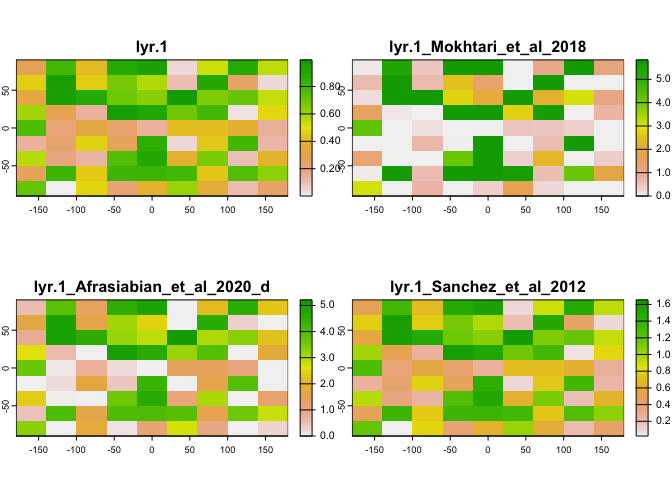

<!-- README.md is generated from README.Rmd. Please edit that file -->


# LAIr: an R package to convert Leaf Area Index (LAI) from Normalized Difference Vegetation Index (NDVI)

## Introduction

Leaf area index ([LAI](https://en.wikipedia.org/wiki/Leaf_area_index)),
defined as the one-sided green leaf area per unit ground surface area
([Chen and Black
1992](https://doi.org/10.1111/j.1365-3040.1992.tb00992.x)), is a key
parameter to predict photosynthesis, evapo-transpiration and growth of
vegetation canopies. As canopy reacts more promptly to the other plant
components to disturbances, LAI is also frequently used for continuous
monitoring of vegetation, being recognized as an Essential Climate
Variable (**ECV**) by the Global Climate Observing System
([GCOS](https://land.copernicus.eu/global/products/lai)).

LAI can be collected in the field, using either direct or indirect
optical methods (for a review, see [Yan et
al. 2019](https://doi.org/10.1016/j.agrformet.2018.11.033), [Chianucci
2020](https://doi.org/10.1139/cjfr-2019-0055)). However, *in situ*
measurements are time-consuming and unpractical for large areas.
Proximal and remotely-sensed information offers a unique way to obtain
spatially-extensive mapping of LAI, from landscape to the global scale.
While active sensors like LiDAR and SAR have recently considered
attention for monitoring LAI ([Wang et
al. 2020](https://doi.org/10.3390/rs12203457)), so far the majority of
applications consider passive optical sensing ([Chianucci et
al. 2016](https://doi.org/10.1016/j.jag.2015.12.005); [Fang et
al. 2019](https://doi.org/10.1029/2018RG000608); [Xie et
al. 2019](https://doi.org/10.1016/j.scitotenv.2019.06.516)).

Passive optical methods typically derive LAI from empirical equation
relating LAI to some vegetation indices (VIs). The Normalized Difference
Vegetation Index (NDVI) is amongst the most widely used VI in vegetation
monitoring, as it is simple and can be derived from the widest array of
multi-spectral sensors currently available. This theoretically allows
for a more consistent retrieval of LAI from passive optical sensing
tools, ranging from field spectroradiometer and multi-spectral imagery,
up to drone, airborne, and satellite optical imagery. However, the
relationship between LAI and NDVI is essentially non-linear, and
sensitive to vegetation type (crop-specific), canopy conditions and
density. Therefore, many conversion equations have been proposed and
published in the literature, deriving from applications in different
regions, on different crops, and with different sensors.

Recently, [Bajocco et al. 2022](https://doi.org/10.3390/rs14153554)
compiled the most comprehensive library of LAI-NDVI conversion formulas
by literature screening. The `LAIr` package provides a simple tool to
implement the conversion formulas available in this library. A single
function `NDVI2LAI()` allows to select the most suitable formula(s) by
selecting those based on available vegetation and sensor attributes, and
apply the conversion equation(s) to raster or numeric inputs. The next
paragraphs describe in detail the methodology and the package
functioning.

## Installation

You can install the development version of LAIr using devtools ([Wickham
et al. 2021](https://CRAN.R-project.org/package=devtools)):

``` r
#install.packages("devtools")
devtools::install_git("https://gitlab.com/fchianucci/LAIr")
```

## Usage

The `LAIr` package features a single `NDVI2LAI` function. The function
allows to import an input Raster\* or numeric vector and select the
suitable conversion equation formula(s) based on a set of optional
vegetation (*category*, *type*, *name*), or sensor (*sensor* name,
*platform*, *resolution*) filtering parameters. If no arguments are not
considered, the function by default implement all the available
functions.

The list of all available LAI-NDVI equations have been compiled by
[Bajocco et al. 2022](https://doi.org/10.3390/rs14153554) and can be
screened by typing `NDVI2LAIeq`, which allows to see also the available
options for each filtering parameter. Here we showed a selected set of
functions and arguments:

``` r
library(LAIr)
head(NDVI2LAIeq)
```

    #> # A tibble: 6 × 11
    #>   Function.ID        F.ID  Plant.Category Plant.Type Plant.Name Location.Biome  
    #>   <chr>              <chr> <chr>          <chr>      <chr>      <chr>           
    #> 1 Johnson_et_al_2001 F001  Crop           Permanent  Vineyard   Mediterranean F…
    #> 2 Wilson_Meyer_2007  F002  Crop           Summer     Maize      Temperate Grass…
    #> 3 Fei_et_al_2012     F003  Crop           Summer     Maize      Temperate Broad…
    #> 4 Tan_et_al_2020_a   F004  Crop           Winter     Wheat      Temperate Broad…
    #> 5 Tan_et_al_2020_b   F005  Crop           Winter     Wheat      Temperate Broad…
    #> 6 Tan_et_al_2020_c   F006  Crop           Winter     Wheat      Temperate Broad…
    #> # ℹ 5 more variables: Location.Country <chr>, Sensor.Name <chr>,
    #> #   Sensor.Platform <chr>, Sensor.Resolution <dbl>,
    #> #   Sensor.ResolutionClass <chr>

Below we showed two basic examples depending on the input values.

### Numeric values

The function returns a dataframe with an ‘input’ column and many columns
as the selected number of conversion equations:

``` r
NDVI2LAI(seq(0.5,1,.2), category = 'Mixed', sensor = c('PROBA-V', 'SPOT'))
#>   input Verger_et_al_2011 Martinez_et_al_2010
#> 1   0.5          1.093126               2.669
#> 2   0.7          2.208209               4.117
#> 3   0.9          7.282413               5.565
```

### Raster\* values

The function `NDVI2LAI` can consider any type of Raster\* input (i.e.,
RasterLayer, RasterBrick or RasterStack). In case of multi-layer images,
the computation is performed for each layer.

``` r
# generate a raster
set.seed(123)
input <- terra::rast(ncol = 9, nrows = 9, vals = runif(81))
res <- NDVI2LAI(input, category = 'Crop', name = c('Vineyard', 'Barley'), sensor = 'MODIS')
terra::plot(res)
```



## Funding

This work has been performed in the framework of GeoMood, an independent
researchers collective focusing on agriculture, forest and environment.
The package was carried out within the Agritech National Research Center
and received funding from the European Union Next-GenerationEU (National
Recovery and Resilience Plan (NRRP) – MISSION 4 COMPONENT 2, INVESTMENT
1.4 – D.D. 1032 17/06/2022, CN00000022). This manuscript reflects only
the author’s views and opinions, neither the European Union nor the
European Commission can be considered responsible for them.

## References

- Bajocco, S., Ginaldi, F., Savian, F., Morelli, D., Scaglione, M.,
  Fanchini, D., Raparelli, E. and Bregaglio, S.U.M., 2022. On the use of
  NDVI to estimate LAI in field crops: Implementing a conversion
  equation library. Remote Sensing, 14(15), p.3554.
  <https://doi.org/10.3390/rs14153554>.

- Chen, J.M. and Black, T.A., 1992. Defining leaf area index for
  non‐flat leaves. Plant, Cell & Environment, 15(4), pp.421-429.
  <https://doi.org/10.1111/j.1365-3040.1992.tb00992.x>.

- Chianucci, F., Disperati, L., Guzzi, D., Bianchini, D., Nardino, V.,
  Lastri, C., Rindinella, A. and Corona, P., 2016. Estimation of canopy
  attributes in beech forests using true colour digital images from a
  small fixed-wing UAV. International journal of applied earth
  observation and geoinformation, 47, pp.60-68.
  <https://doi.org/10.1016/j.jag.2015.12.005>.

- Chianucci, F., 2020. An overview of in situ digital canopy photography
  in forestry. Canadian Journal of Forest Research, 50(3), pp.227-242.
  <https://doi.org/10.1139/cjfr-2019-0055>.

- Fang, H., Baret, F., Plummer, S. and Schaepman‐Strub, G., 2019. An
  overview of global leaf area index (LAI): Methods, products,
  validation, and applications. Reviews of Geophysics, 57(3),
  pp.739-799.
  \[<https://doi.org/10.1029/2018RG000608>\](<https://doi.org/10.1029/2018RG000608>.

- Wang, Y. and Fang, H., 2020. Estimation of LAI with the LiDAR
  technology: A review. Remote Sensing, 12(20), p.3457.
  \[<https://doi.org/10.3390/rs12203457>\](<https://doi.org/10.3390/rs12203457>.

- Wickham, H., Hester, J., Chang, W., Bryan, J. (2022). \_devtools:
  Tools to Make Developing R Packages Easier. R package version 2.4.5,
  <https://CRAN.R-project.org/package=devtools>.

- Xie, X., Li, A., Jin, H., Tan, J., Wang, C., Lei, G., Zhang, Z.,
  Bian, J. and Nan, X., 2019. Assessment of five satellite-derived LAI
  datasets for GPP estimations through ecosystem models. Science of The
  Total Environment, 690, pp.1120-1130.
  <https://doi.org/10.1016/j.scitotenv.2019.06.516>

<!-- -->

- Yan, G., Hu, R., Luo, J., Weiss, M., Jiang, H., Mu, X., Xie, D. and
  Zhang, W., 2019. Review of indirect optical measurements of leaf area
  index: Recent advances, challenges, and perspectives. Agricultural and
  forest meteorology, 265, pp.390-411.
  <https://doi.org/10.1016/j.agrformet.2018.11.033>.
